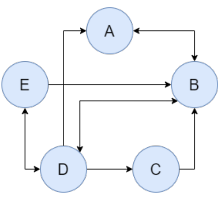

# Chandy-Lamport Algorithm

Network Connectivity Directed Graph: 

### Project structure

1.  We have 5 clients in total,  each these clients handle by a main process window

2. Main process: 

   1. Initial the Socket connections:
      + `A: 10001, B: 10002, C:10003, D:10004, E:10005` (Port number)
      + Input a agrv detect the user ---Auto Script
      + Depend the Graph to connect with Sockets
      + Bind Socket success, put in `receive_List[]` & `send_List[]`  -------> create `receive_handler()` Thread for each socket in `receiver_list[]`
      + Create a `user_input()` thread --> (while true)
   2. `receive_handler()` while true `recv()`,  if message exist ------> create new `receive_process()` thread and with lock to handle the token
   3. User interface:
      + Initial a token
      + Start a snapshot
      + start message passing perturbation: `perturb_tag`
   4. Local state:  local token states
   5. Channel States:  (A, B) tuple
   

   

   
